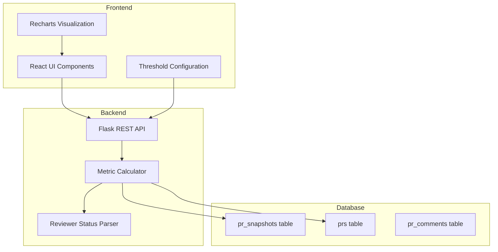
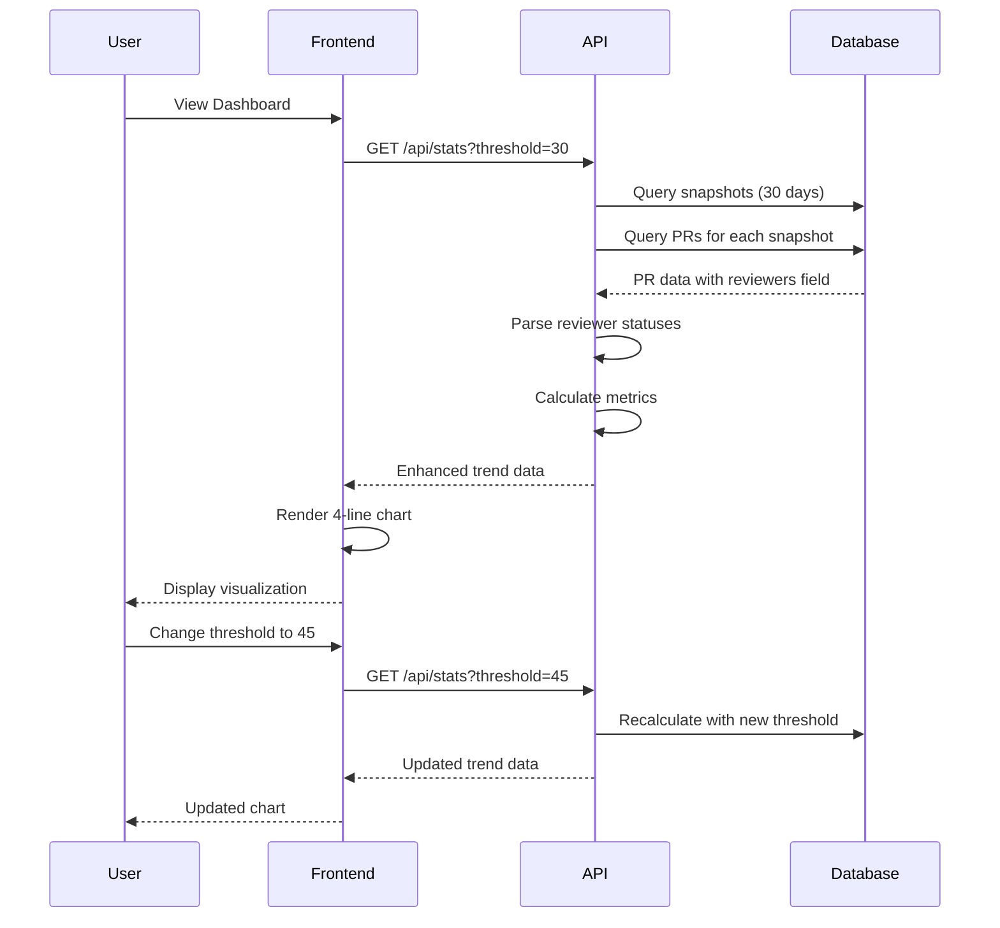

# Design Document: PR Trend Enhancement

## Overview

This design enhances the PR Tracker's 30-day trend feature to provide detailed metrics calculated from actual PR data rather than pre-aggregated snapshot values. The enhancement introduces four key metrics: total PRs, PRs under review, PRs with two approvals, and old PRs (with configurable threshold). The design focuses on efficient SQL-based calculations, backward-compatible API changes, and enhanced frontend visualization.

### Key Design Decisions

1. **SQL-Based Calculation**: All metric calculations will be performed in DuckDB using SQL queries rather than application-level processing. This leverages database optimization and reduces memory overhead.

2. **Backward Compatibility**: The existing `/api/stats` endpoint structure will be preserved, with new fields added to the trend array. Existing consumers will continue to work without modification.

3. **Configurable Threshold**: The old PR threshold will be passed as a query parameter, allowing dynamic adjustment without code changes.

4. **Date-Based Calculation**: Metrics will be calculated for each snapshot date by examining PR records associated with that snapshot, using PR timestamps to determine state at that point in time.

## Architecture

### System Components



### Data Flow



## Components and Interfaces

### Backend API Changes

#### Enhanced `/api/stats` Endpoint

**Query Parameters:**
- `threshold` (optional, integer, default=30): Number of days to consider a PR "old"
- `days` (optional, integer, default=30): Number of days of trend data to return

**Response Format:**
```json
{
  "latest": {
    "id": 123,
    "snapshot_date": "2025-01-15T10:30:00",
    "repo_owner": "owner",
    "repo_name": "repo",
    "total_prs": 45,
    "unassigned_count": 5,
    "old_prs_count": 12
  },
  "trend": [
    {
      "snapshot_date": "2024-12-16T10:00:00",
      "total_prs": 42,
      "under_review_count": 35,
      "two_approvals_count": 8,
      "old_prs_count": 10
    },
    ...
  ],
  "reviewers": [...]
}
```

**New Fields in Trend Array:**
- `under_review_count`: Count of PRs with at least one assigned reviewer
- `two_approvals_count`: Count of PRs with at least two [APPROVED] statuses

### Reviewer Status Parser

**Purpose:** Extract and parse reviewer approval statuses from the `reviewers` VARCHAR field.

**Input Format:** `"username1 [APPROVED], username2 [NO ACTION], username3 [APPROVED]"`

**Parsing Logic:**
```python
def parse_reviewer_statuses(reviewers_str):
    """
    Parse reviewers string and extract approval statuses.
    
    Returns:
        tuple: (has_reviewers, approval_count)
    """
    if not reviewers_str or reviewers_str == "None":
        return (False, 0)
    
    approval_count = 0
    reviewers = reviewers_str.split(", ")
    
    for reviewer in reviewers:
        if "[APPROVED]" in reviewer:
            approval_count += 1
    
    return (True, approval_count)
```

**SQL Implementation:**
The parsing will be done directly in SQL using DuckDB string functions:

```sql
-- Check if PR has reviewers
CASE 
    WHEN reviewers IS NULL OR reviewers = 'None' THEN 0
    ELSE 1
END AS has_reviewers

-- Count approvals
LENGTH(reviewers) - LENGTH(REPLACE(reviewers, '[APPROVED]', '')) / LENGTH('[APPROVED]') AS approval_count
```

### Database Query Design

#### Efficient Trend Calculation Query

```sql
WITH snapshot_dates AS (
    SELECT 
        id AS snapshot_id,
        snapshot_date,
        repo_owner,
        repo_name
    FROM pr_snapshots
    WHERE snapshot_date >= CURRENT_TIMESTAMP - INTERVAL '{days} DAYS'
    ORDER BY snapshot_date ASC
),
pr_metrics AS (
    SELECT 
        p.snapshot_id,
        COUNT(*) AS total_prs,
        SUM(CASE 
            WHEN p.reviewers IS NOT NULL AND p.reviewers != 'None' 
            THEN 1 ELSE 0 
        END) AS under_review_count,
        SUM(CASE 
            WHEN (LENGTH(p.reviewers) - LENGTH(REPLACE(p.reviewers, '[APPROVED]', ''))) / LENGTH('[APPROVED]') >= 2
            THEN 1 ELSE 0 
        END) AS two_approvals_count,
        SUM(CASE 
            WHEN p.age_days > {threshold}
            THEN 1 ELSE 0 
        END) AS old_prs_count
    FROM prs p
    WHERE p.state = 'open'
    GROUP BY p.snapshot_id
)
SELECT 
    sd.snapshot_date,
    COALESCE(pm.total_prs, 0) AS total_prs,
    COALESCE(pm.under_review_count, 0) AS under_review_count,
    COALESCE(pm.two_approvals_count, 0) AS two_approvals_count,
    COALESCE(pm.old_prs_count, 0) AS old_prs_count
FROM snapshot_dates sd
LEFT JOIN pr_metrics pm ON sd.snapshot_id = pm.snapshot_id
ORDER BY sd.snapshot_date ASC;
```

**Query Optimization:**
- Uses CTE (Common Table Expression) for clarity and potential optimization
- Single pass through prs table with aggregation
- Leverages existing indexes on `snapshot_id` and `snapshot_date`
- COALESCE handles snapshots with no PRs
- All calculations done in database, minimizing data transfer

### Frontend Components

#### Enhanced Trend Chart Component

**New Props:**
- `threshold`: Current old PR threshold value
- `onThresholdChange`: Callback for threshold updates

**Chart Configuration:**
```javascript
<LineChart data={stats.trend}>
  <CartesianGrid strokeDasharray="3 3" />
  <XAxis 
    dataKey="snapshot_date" 
    tickFormatter={(date) => new Date(date).toLocaleDateString()}
  />
  <YAxis />
  <Tooltip labelFormatter={(date) => new Date(date).toLocaleString()} />
  <Legend />
  <Line type="monotone" dataKey="total_prs" stroke="#0066cc" name="Total PRs" />
  <Line type="monotone" dataKey="under_review_count" stroke="#28a745" name="Under Review" />
  <Line type="monotone" dataKey="two_approvals_count" stroke="#6f42c1" name="Two Approvals" />
  <Line type="monotone" dataKey="old_prs_count" stroke="#ffa500" name="Old PRs" />
</LineChart>
```

**Color Scheme:**
- Total PRs: Blue (#0066cc) - Primary metric
- Under Review: Green (#28a745) - Positive progress
- Two Approvals: Purple (#6f42c1) - Near completion
- Old PRs: Orange (#ffa500) - Warning indicator

#### Threshold Configuration Component

```javascript
<div className="threshold-config">
  <label htmlFor="threshold">Old PR Threshold (days):</label>
  <input
    id="threshold"
    type="number"
    min="1"
    value={threshold}
    onChange={(e) => handleThresholdChange(parseInt(e.target.value))}
  />
  <span className="threshold-info">
    Currently showing PRs older than {threshold} days as "old"
  </span>
</div>
```

**Validation:**
- Minimum value: 1 day
- Maximum value: 365 days (reasonable upper bound)
- Input type: number with step=1
- Debounced API calls (500ms delay after user stops typing)

## Data Models

### Existing Schema (No Changes Required)

The current schema already supports all required functionality:

```sql
CREATE TABLE pr_snapshots (
    id INTEGER PRIMARY KEY,
    snapshot_date TIMESTAMP DEFAULT CURRENT_TIMESTAMP,
    repo_owner VARCHAR NOT NULL,
    repo_name VARCHAR NOT NULL,
    total_prs INTEGER,
    unassigned_count INTEGER,
    old_prs_count INTEGER
);

CREATE TABLE prs (
    id INTEGER PRIMARY KEY,
    snapshot_id INTEGER,
    pr_number INTEGER,
    title VARCHAR,
    url VARCHAR,
    created_at TIMESTAMP,
    updated_at TIMESTAMP,
    age_days INTEGER,
    reviewers VARCHAR,  -- Format: "user1 [STATUS], user2 [STATUS]"
    state VARCHAR,
    FOREIGN KEY (snapshot_id) REFERENCES pr_snapshots(id)
);
```

**Key Fields for Enhancement:**
- `prs.reviewers`: Contains reviewer names and statuses in parseable format
- `prs.age_days`: Pre-calculated age for threshold comparison
- `prs.state`: Filter for "open" PRs only
- `prs.snapshot_id`: Links PRs to specific snapshot dates

### Reviewer Status Format

**Format Specification:**
```
reviewers := <reviewer_entry> | <reviewer_entry> ", " <reviewers>
reviewer_entry := <username> " [" <status> "]"
status := "APPROVED" | "NO ACTION" | "CHANGES_REQUESTED" | ...
```

**Examples:**
- Single reviewer: `"alice [APPROVED]"`
- Multiple reviewers: `"alice [APPROVED], bob [NO ACTION], charlie [APPROVED]"`
- No reviewers: `NULL` or `"None"`

**Parsing Strategy:**
1. Check for NULL or "None" → no reviewers
2. Split on ", " to get individual entries
3. For each entry, check if it contains "[APPROVED]"
4. Count total entries (under review) and approved entries


## Correctness Properties

*A property is a characteristic or behavior that should hold true across all valid executions of a system—essentially, a formal statement about what the system should do. Properties serve as the bridge between human-readable specifications and machine-verifiable correctness guarantees.*

### Property Reflection

After analyzing all acceptance criteria, I identified several areas of redundancy:

1. **Criteria 1.1 and 1.2** both test reviewer parsing and counting - these can be combined into a single property about counting PRs with reviewers
2. **Criteria 2.1 and 2.3** both test parsing of the reviewers field format - these can be combined into one comprehensive parsing property
3. **Criteria 3.5 and 7.4** both test that changing threshold triggers API calls - these are the same behavior
4. **Criteria 4.2 and 4.5** both test that metrics are calculated from PR records - can be combined
5. **Multiple "example" criteria** (1.4, 2.4, 5.1, 5.2) test API response structure - can be verified in a single integration test

After reflection, the unique testable properties are:

### Property 1: Under Review Count Accuracy

*For any* set of PRs in a snapshot, the under_review_count should equal the number of PRs where the reviewers field is not NULL and not equal to "None".

**Validates: Requirements 1.1, 1.2**

### Property 2: Reviewer String Parsing

*For any* valid reviewers string in the format "username [STATUS], username2 [STATUS], ...", parsing should correctly extract all reviewer entries and their statuses without errors.

**Validates: Requirements 2.1, 2.3**

### Property 3: Two Approvals Count Accuracy

*For any* set of PRs in a snapshot, the two_approvals_count should equal the number of PRs where the reviewers field contains at least two occurrences of "[APPROVED]".

**Validates: Requirements 2.2**

### Property 4: Threshold-Based Old PR Calculation

*For any* positive integer threshold value and any set of PRs, the old_prs_count should equal the number of PRs where age_days is greater than the threshold value.

**Validates: Requirements 3.3**

### Property 5: PR Filtering by Date and State

*For any* snapshot date, the calculated metrics should only include PRs where created_at is less than or equal to the snapshot date AND state equals "open".

**Validates: Requirements 4.2**

### Property 6: Age Calculation Consistency

*For any* PR and any snapshot date, the calculated age_days should equal the number of days between the PR's created_at date and the snapshot date.

**Validates: Requirements 4.3**

### Property 7: Trend Data Ordering

*For any* set of snapshots returned in the trend array, the snapshots should be ordered by snapshot_date in ascending chronological order.

**Validates: Requirements 5.3**

### Property 8: Time Window Filtering

*For any* requested time window (days parameter), the trend results should only include snapshots where snapshot_date is within that many days from the current date.

**Validates: Requirements 8.2**

### Property 9: Threshold Input Validation

*For any* user input to the threshold field, the system should only accept positive integers and reject zero, negative numbers, and non-numeric values.

**Validates: Requirements 7.3**

### Property 10: Threshold Change Triggers Refresh

*For any* valid threshold value change in the UI, the frontend should make an API request with the new threshold parameter.

**Validates: Requirements 3.5, 7.4**

### Property 11: Date Formatting Consistency

*For any* date value displayed on the X-axis or in tooltips, the formatted string should be a valid, human-readable date representation.

**Validates: Requirements 6.4**

## Error Handling

### Backend Error Scenarios

1. **Invalid Threshold Parameter**
   - **Condition**: User provides non-numeric or negative threshold
   - **Response**: 400 Bad Request with error message
   - **Example**: `{"error": "threshold must be a positive integer"}`

2. **Database Connection Failure**
   - **Condition**: Cannot connect to DuckDB database
   - **Response**: 500 Internal Server Error
   - **Logging**: Log full error with stack trace
   - **User Message**: "Unable to fetch trend data. Please try again."

3. **Malformed Reviewers Field**
   - **Condition**: Reviewers field contains unexpected format
   - **Handling**: Log warning, treat as no reviewers (count as 0)
   - **Rationale**: Graceful degradation prevents entire query failure

4. **Missing Snapshot Data**
   - **Condition**: No snapshots exist in requested time window
   - **Response**: Return empty trend array `[]`
   - **Status**: 200 OK (not an error condition)

5. **Query Timeout**
   - **Condition**: Database query exceeds 5 second timeout
   - **Response**: 504 Gateway Timeout
   - **Logging**: Log query and parameters for investigation
   - **User Message**: "Request timed out. Try reducing the time window."

### Frontend Error Scenarios

1. **API Request Failure**
   - **Condition**: Network error or API returns error status
   - **Handling**: Display error message to user
   - **Retry**: Provide "Retry" button
   - **Fallback**: Show last successful data if available

2. **Invalid Threshold Input**
   - **Condition**: User enters invalid threshold value
   - **Handling**: Show inline validation error
   - **Prevention**: Disable submit until valid
   - **Message**: "Please enter a positive number"

3. **Empty Data Response**
   - **Condition**: API returns empty trend array
   - **Handling**: Display "No data available" message
   - **Suggestion**: Prompt user to import data

4. **Chart Rendering Failure**
   - **Condition**: Recharts fails to render (malformed data)
   - **Handling**: Catch error boundary, show fallback UI
   - **Logging**: Log error to console for debugging
   - **Fallback**: Display data in table format

### Error Recovery Strategies

1. **Automatic Retry**: Network errors trigger automatic retry after 2 seconds (max 3 attempts)
2. **Graceful Degradation**: If new metrics fail, fall back to showing only total_prs
3. **User Notification**: All errors display user-friendly messages, not technical details
4. **Logging**: All errors logged with context for debugging

## Testing Strategy

### Dual Testing Approach

This feature will use both unit tests and property-based tests to ensure comprehensive coverage:

- **Unit tests**: Verify specific examples, edge cases, API response structure, and UI component rendering
- **Property tests**: Verify universal properties across all inputs using randomized data

### Property-Based Testing

**Library Selection**: 
- Backend (Python): Use `hypothesis` library for property-based testing
- Frontend (JavaScript): Use `fast-check` library for property-based testing

**Configuration**:
- Minimum 100 iterations per property test
- Each test tagged with feature name and property reference
- Tag format: `# Feature: pr-trend-enhancement, Property {number}: {property_text}`

**Property Test Implementation Plan**:

1. **Property 1 - Under Review Count**: Generate random sets of PRs with various reviewer field values (NULL, "None", valid strings), calculate expected count, verify API returns same count

2. **Property 2 - Reviewer Parsing**: Generate random valid reviewer strings with varying numbers of reviewers and statuses, verify parser extracts all entries without errors

3. **Property 3 - Two Approvals Count**: Generate random sets of PRs with 0-5 approvals each, verify count matches PRs with >= 2 approvals

4. **Property 4 - Threshold Calculation**: Generate random threshold values (1-365) and random PR ages (0-500 days), verify old_prs_count matches PRs where age > threshold

5. **Property 5 - PR Filtering**: Generate random PRs with various created_at dates and states, verify only open PRs created before snapshot date are included

6. **Property 6 - Age Calculation**: Generate random PR created_at dates and snapshot dates, verify age_days equals date difference

7. **Property 7 - Trend Ordering**: Generate random snapshots with unsorted dates, verify API returns them in ascending order

8. **Property 8 - Time Window Filtering**: Generate random time windows (1-90 days), verify results only include snapshots within window

9. **Property 9 - Threshold Validation**: Generate random inputs (negative, zero, non-numeric, valid), verify validation accepts only positive integers

10. **Property 10 - Threshold Change**: Generate random valid threshold changes, verify each triggers API call with correct parameter

11. **Property 11 - Date Formatting**: Generate random dates, verify formatted strings are valid and human-readable

### Unit Testing

**Backend Unit Tests**:
- Test API endpoint accepts threshold parameter
- Test default threshold value is 30
- Test API response structure includes all required fields
- Test backward compatibility (existing fields still present)
- Test empty database returns empty trend array
- Test error handling for invalid parameters
- Test single SQL query execution (no N+1 queries)

**Frontend Unit Tests**:
- Test threshold input component renders
- Test threshold input displays default value
- Test chart renders with four lines
- Test each line has distinct color
- Test legend component renders
- Test tooltip displays on hover
- Test API response structure validation
- Test error message display

### Integration Testing

**End-to-End Scenarios**:
1. User loads dashboard → sees 4-line trend chart with default threshold
2. User changes threshold to 45 → chart updates with new old PR counts
3. User imports new data → trend chart includes new snapshot
4. Database has no data → displays "No data available" message
5. API returns error → displays error message with retry button

### Performance Testing

**Benchmarks**:
- Trend calculation for 30 days of data: < 2 seconds
- Trend calculation for 90 days of data: < 5 seconds
- Frontend chart rendering: < 500ms
- Threshold change response: < 1 second (including API call)

**Load Testing**:
- 10 concurrent users requesting trend data
- Database with 1000+ snapshots and 50,000+ PRs
- Verify response times remain within acceptable limits

### Test Data Generation

**Realistic Test Data**:
- Generate snapshots spanning 90 days
- 20-60 PRs per snapshot (realistic range)
- Reviewer strings with 0-5 reviewers per PR
- Mix of approval statuses: APPROVED, NO ACTION, CHANGES_REQUESTED
- PR ages ranging from 0-180 days
- Mix of open and closed PRs

**Edge Cases**:
- Empty database (no snapshots)
- Snapshot with no PRs
- PRs with NULL reviewers field
- PRs with "None" reviewers field
- PRs with single reviewer
- PRs with 10+ reviewers
- Very old PRs (>365 days)
- PRs created in the future (clock skew)
- Threshold values at boundaries (1, 30, 365)

