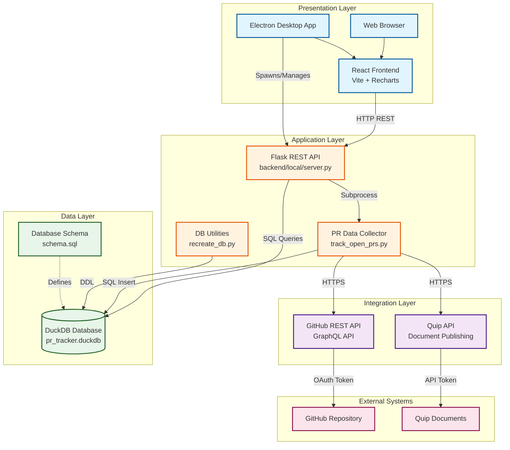

# PR Tracker System Architecture

## TOGAF Architecture Diagram

## Component Details

### Presentation Layer
- **React Frontend**: Single-page application with dashboard, snapshot comparison, and charts
- **Technologies**: React 18, Vite, Recharts for visualization
- **Electron Desktop App**: Wraps the web frontend in a native window, manages the backend lifecycle
  - Spawns Flask as a child process
  - Injects backend port into the frontend via `window.__BACKEND_PORT__`
  - Provides native menus (Import Data, Reset Database, About)
  - Auto-loads the most recent snapshot on startup

### Application Layer
- **Flask REST API**: 
  - Endpoints: `/api/snapshots`, `/api/stats`, `/api/import`, `/api/snapshots/compare`
  - Port: 5001 (configurable via `FLASK_PORT` env var)
  - Checkpoints DuckDB on shutdown to ensure data persistence
  - Idempotent schema initialization (safe on existing databases)

- **PR Data Collector**:
  - Fetches open PRs from GitHub
  - Calculates metrics (age, reviewer workload, comments)
  - Modes: Quip publish, Database store, stdout

- **DB Utilities**:
  - Database creation and recreation
  - Schema migration support

### Integration Layer
- **GitHub API**: 
  - REST API for PR data
  - GraphQL API for review comments
  - Authentication: Personal Access Token

- **Quip API**:
  - Document creation and updates
  - Markdown formatting support
  - Authentication: API Token

### Data Layer
- **DuckDB Database**:
  - Analytical database optimized for OLAP queries
  - Tables: `pr_snapshots`, `prs`, `pr_comments`
  - Sequences for auto-incrementing IDs
  - Indexes on foreign keys and dates
  - WAL checkpointed on graceful shutdown

### External Systems
- **GitHub Repository**: Source of PR data
- **Quip**: Team documentation and reporting

## Data Flow

### Real-time Data Collection
1. User clicks "Import New Data" in UI (or `Cmd+I` in Electron)
2. API spawns `track_open_prs.py --store` subprocess
3. Script fetches current PR state from GitHub
4. Data stored in DuckDB with timestamp
5. UI refreshes to show new snapshot

### Dashboard Display
1. UI requests `/api/stats` and `/api/snapshots`
2. API queries DuckDB for:
   - Latest snapshot summary
   - 30-day trend data
   - Current reviewer workload with comment and approval counts
3. Most recent snapshot is auto-selected and its PRs loaded
4. Data rendered in charts and tables with traffic light indicators

### Snapshot Comparison
1. User selects two snapshots in the Compare tab
2. UI requests `/api/snapshots/compare?snapshot1=X&snapshot2=Y`
3. API compares PR lists between snapshots
4. Returns categorized results: new PRs, closed PRs, status changed, unchanged

### Electron Startup
1. Electron finds an available port
2. Spawns Flask backend (venv Python in dev, PyInstaller binary in production)
3. Sets `DB_PATH` to OS user data directory for persistent storage
4. Polls `/api/stats` until backend responds
5. Injects `__BACKEND_PORT__` into frontend HTML
6. Loads frontend in BrowserWindow

### Electron Shutdown
1. User closes window or quits app
2. Flask receives `SIGTERM`
3. `atexit` handler runs `CHECKPOINT` on DuckDB to flush WAL
4. Backend process exits cleanly

## Deployment Options

### Local Development (Web)
- Frontend: `npm run dev` (port 5173, Vite proxy to backend)
- Backend: `python server.py` (port 5001)
- Database: Local DuckDB file in `backend/local/`

### Electron Desktop App
- Frontend: Pre-built by Vite into `electron/frontend-dist/`
- Backend: Bundled via PyInstaller as a single executable
- Database: OS user data directory (persists across restarts)
- Distribution: DMG (macOS), AppImage/deb (Linux), NSIS/portable (Windows)

## Security Considerations

- GitHub token stored in environment variable
- Quip token stored in environment variable
- No authentication on API (local/desktop use only)
- CORS enabled for local frontend access
- Electron uses `contextIsolation: true` and `nodeIntegration: false`

## Technology Stack

| Layer | Technology | Version |
|-------|-----------|---------|
| Frontend | React | 18.x |
| Frontend Build | Vite | 5.x |
| Charts | Recharts | 2.x |
| Backend | Flask | 3.0.0 |
| Backend | Python | 3.12+ |
| Database | DuckDB | 1.0.0+ |
| Desktop | Electron | 29.x |
| Packaging | electron-builder | 24.x |
| Backend Bundling | PyInstaller | latest |
| Testing | pytest | 7.x |
| Testing | Vitest | 1.x |

## Key Design Decisions

1. **DuckDB over SQLite**: Better analytical query performance for time-series data
2. **Subprocess execution**: Isolate long-running data collection from API server
3. **In-memory testing**: Fast test execution with proper isolation
4. **RETURNING clauses**: Efficient ID retrieval without separate queries
5. **Electron + Flask child process**: Reuse the existing web backend without rewriting; dynamic port allocation avoids conflicts
6. **Port injection via HTML rewrite**: Backend port is injected into a `<script>` tag in `<head>` before React loads, avoiding race conditions with `did-finish-load`
7. **Idempotent schema init**: `CREATE IF NOT EXISTS` allows safe startup on both fresh and existing databases
8. **DuckDB CHECKPOINT on shutdown**: Ensures WAL data is flushed to disk when the app exits
