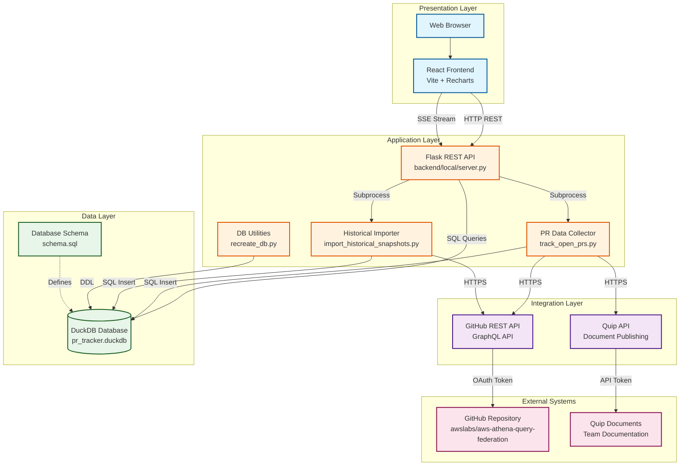

# PR Tracker System Architecture

## TOGAF Architecture Diagram

## Component Details

### Presentation Layer
- **React Frontend**: Single-page application with dashboard, charts, and historical import UI
- **Technologies**: React 18, Vite, Recharts for visualization

### Application Layer
- **Flask REST API**: 
  - Endpoints: `/api/snapshots`, `/api/stats`, `/api/import`, `/api/import-historical`
  - Server-Sent Events for real-time progress updates
  - Port: 5000 (local development)

- **PR Data Collector**:
  - Fetches open PRs from GitHub
  - Calculates metrics (age, reviewer workload, comments)
  - Modes: Quip publish, Database store, stdout

- **Historical Importer**:
  - Backfills weekly snapshots
  - Prevents duplicate imports
  - Streams progress updates

- **DB Utilities**:
  - Database creation and recreation
  - Schema migration support

### Integration Layer
- **GitHub API**: 
  - REST API for PR data
  - GraphQL API for review comments
  - Authentication: Personal Access Token

- **Quip API**:
  - Document creation and updates
  - Markdown formatting support
  - Authentication: API Token

### Data Layer
- **DuckDB Database**:
  - Analytical database optimized for OLAP queries
  - Tables: `pr_snapshots`, `prs`, `pr_comments`
  - Sequences for auto-incrementing IDs
  - Indexes on foreign keys and dates

### External Systems
- **GitHub Repository**: Source of PR data
- **Quip**: Team documentation and reporting

## Data Flow

### Real-time Data Collection
1. User clicks "Import New Data" in UI
2. API spawns `track_open_prs.py --store` subprocess
3. Script fetches current PR state from GitHub
4. Data stored in DuckDB with timestamp
5. UI refreshes to show new snapshot

### Historical Data Import
1. User selects date range in Historical Import tab
2. API streams `import_historical_snapshots.py` execution
3. Script generates weekly dates
4. For each date:
   - Check if snapshot exists (skip if duplicate)
   - Fetch PRs that were open at that date
   - Store snapshot with historical timestamp
5. Progress updates streamed via SSE to UI

### Dashboard Display
1. UI requests `/api/stats`
2. API queries DuckDB for:
   - Latest snapshot summary
   - 30-day trend data
   - Current reviewer workload with comment counts
3. Data rendered in charts and tables

## Deployment Options

### Local Development
- Frontend: `npm run dev` (port 5173)
- Backend: `python server.py` (port 5000)
- Database: Local DuckDB file

### AWS Lambda (Future)
- Handler: `backend/lambda/handler.py`
- Database: DuckDB in Lambda layer or EFS
- Frontend: S3 + CloudFront

## Security Considerations

- GitHub token stored in environment variable
- Quip token stored in environment variable
- No authentication on API (local development only)
- CORS enabled for local frontend access

## Technology Stack

| Layer | Technology | Version |
|-------|-----------|---------|
| Frontend | React | 18.x |
| Frontend Build | Vite | 5.x |
| Charts | Recharts | 2.x |
| Backend | Flask | 3.0.0 |
| Backend | Python | 3.12+ |
| Database | DuckDB | 1.0.0+ |
| Testing | unittest | stdlib |
| Testing | Vitest | 1.x |

## Key Design Decisions

1. **DuckDB over SQLite**: Better analytical query performance for time-series data
2. **Server-Sent Events**: Real-time progress updates without WebSocket complexity
3. **Subprocess execution**: Isolate long-running data collection from API server
4. **In-memory testing**: Fast test execution with proper isolation
5. **RETURNING clauses**: Efficient ID retrieval without separate queries
